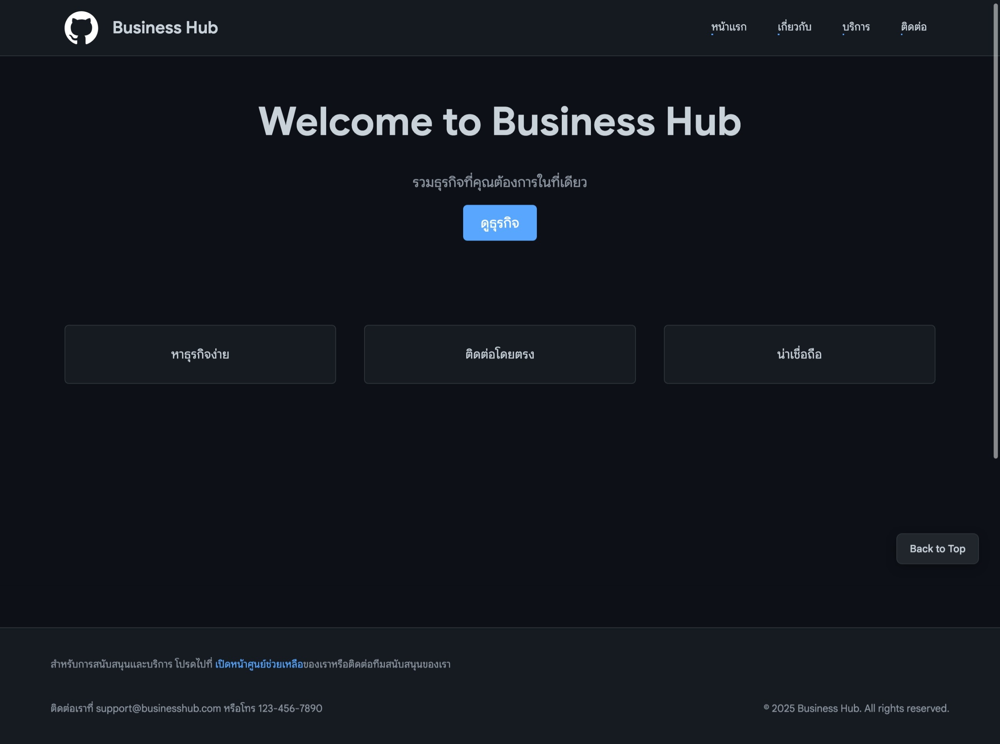
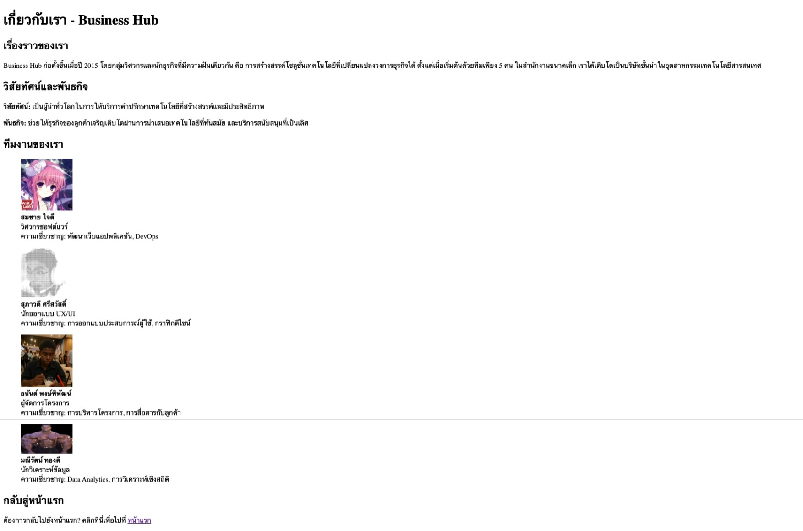
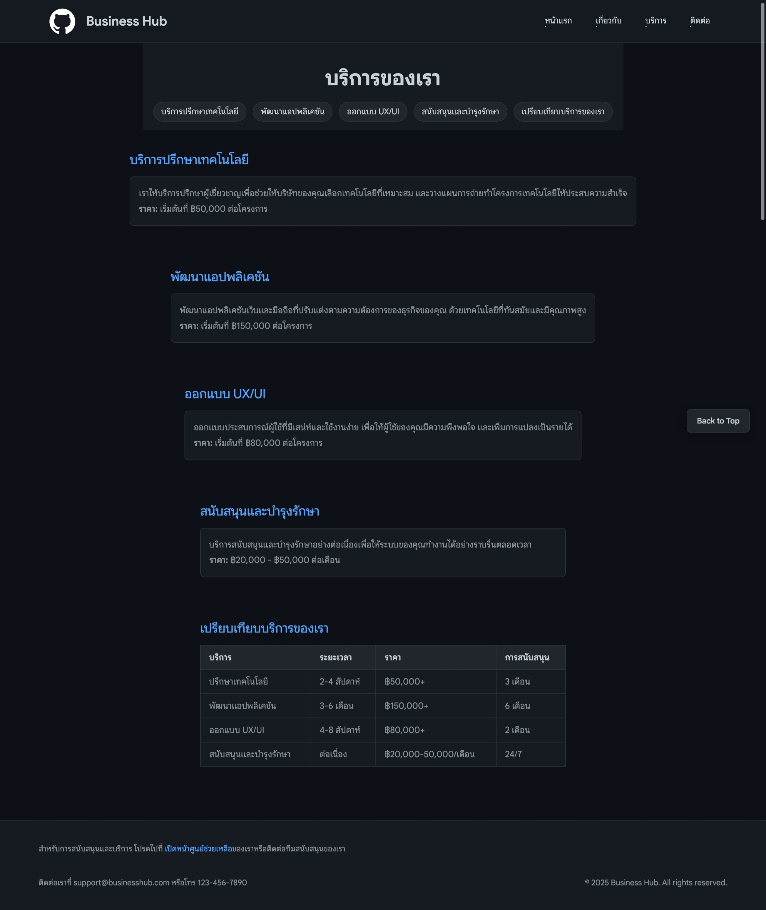
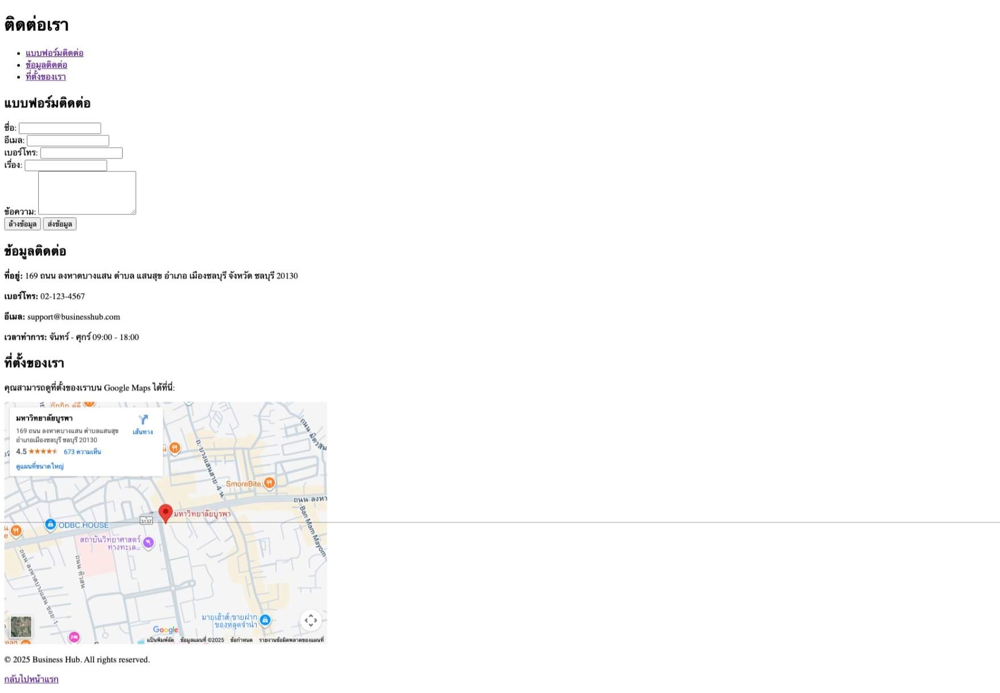

# My Business Hub Website

#### เว็บไซต์สำหรับค้นหาธุรกิจที่คุณถูกใจและติดต่อกับเจ้าของได้โดยตรง

## เนื้อหา

- [โครงสร้างโปรเจกต์](#project-structure)
- [CSS Structure & Layout](#css-structure--layout)
- [ภาพหน้าจอ](#screenshots)

## Project Structure:

- [`index.html`](index.html): หน้าแรกของเว็บไซต์ที่แสดงรายชื่อธุรกิจต่างๆ
- [`about.html`](about.html): หน้าข้อมูลเกี่ยวกับเว็บไซต์และวิธีการใช้งาน
- [`services.html`](services.html): หน้ารายละเอียดบริการต่างๆ
- [`contact.html`](contact.html): หน้าติดต่อเรา
- `images/`: โฟลเดอร์ที่เก็บรูปภาพที่ใช้ในเว็บไซต์
- `.gitignore`: ไฟล์สำหรับระบุไฟล์หรือโฟลเดอร์ที่ไม่ต้องการให้ Git ติดตาม

## CSS Structure & Layout

เว็บไซต์ใช้ CSS แบบ modular โดยแบ่งเป็นไฟล์หลัก `universal.css` และไฟล์เฉพาะหน้าใน `css/` directory

### Selectors

| Type | Examples | Usage |
|------|----------|-------|
| **ID Selectors** | `#header`, `#footer`, `#main-features` | ใช้กับองค์ประกอบที่ไม่ซ้ำกัน เช่น header, footer |
| **Class Selectors** | `.hero`, `.nav-underline`, `.contact-card`, `.btn-primary` | ใช้กับองค์ประกอบที่ใช้ซ้ำได้หลายครั้ง |
| **Element Selectors** | `body`, `main`, `section`, `h1`, `p`, `a` | ใช้กับ HTML elements ทั่วไป |
| **Descendant Selectors** | `#header div a`, `.contact-card ul a`, `.form-field input` | ใช้เลือกองค์ประกอบภายในองค์ประกอบอื่น |
| **Pseudo-classes** | `:hover`, `:nth-child(even)` | ใช้กับ state หรือตำแหน่งขององค์ประกอบ |
| **Attribute Selectors** | `section[id]`, `input::placeholder` | ใช้เลือกองค์ประกอบตาม attribute หรือ pseudo-elements |

### CSS Units

| Unit | Usage |
|------|-------|
| **px** | ใช้สำหรับค่าคงที่ เช่น padding, margin, border-radius, font-size ขนาดเล็ก |
| **rem** | ใช้สำหรับ font-size ขนาดใหญ่ (responsive typography) |
| **%** | ใช้สำหรับความกว้าง, การแปลง และการจัดตำแหน่ง |
| **vh/vw** | ใช้สำหรับความสูงขั้นต่ำ (min-height: 100vh) |
| **fr** | ใช้ใน CSS Grid (grid-template-columns: 1fr 1fr) |

### Color Palette

เว็บไซต์ใช้ GitHub Dark Theme โดยกำหนดผ่าน CSS Custom Properties:

| Color | Hex Code | Usage |
|-------|----------|-------|
| **--gh-dark-bg-primary** | `#0d1117` | พื้นหลังหลักของเว็บไซต์ (body, main) |
| **--gh-dark-bg-secondary** | `#161b22` | พื้นหลังรอง (header, footer, cards) |
| **--gh-dark-bg-tertiary** | `#21262d` | พื้นหลังสำหรับการเน้น (hover states, inputs) |
| **--gh-dark-border** | `#30363d` | สีของเส้นขอบทั่วไป |
| **--gh-dark-text-primary** | `#c9d1d9` | สีข้อความหลัก |
| **--gh-dark-text-secondary** | `#8b949e` | สีข้อความรอง (descriptions, labels) |
| **--gh-accent-blue** | `#58a6ff` | สีเน้นหลัก (links, buttons, highlights) |
| **--gh-accent-green** | `#3fb950` | สีสำหรับ success states |
| **--gh-accent-orange** | `#d29922` | สีสำหรับ warning states |
| **--gh-accent-red** | `#f85149` | สีสำหรับ error states |

### Typography

**Font Family**: Google Sans (Google Fonts) with sans-serif fallback
```css
font-family: "Google Sans", sans-serif;
```

**Font Weights**: 
- 400 (normal) - ใช้กับข้อความทั่วไป
- 500 (medium) - ใช้กับ labels และ buttons
- 600 (semi-bold) - ใช้กับ headers ขนาดเล็ก
- 700 (bold) - ใช้กับ headings ขนาดใหญ่

**Line Height**: 
- 1.2 (hero headings)
- 1.6 (body text, lists)
- 1.8 (paragraphs, article content)

**Font Sizes**:
- Hero: `3.5rem` (mobile: `2rem`)
- H1: `2.5rem` (mobile: `1.6rem` - `1.8rem`)
- H2: `1.5rem`
- Body: `0.9rem` - `1.1rem`
- Small text: `0.85rem` - `0.95rem`

**Text Effects**: 
- `text-decoration: none` (links)
- `text-align: center` (hero, cards)
- `text-transform` (buttons)
- `letter-spacing` (headings)

### Box Model

**Padding**: 
- Containers: `40px 20px`, `60px 20px`
- Cards: `16px`
- Buttons: `8px 12px` - `12px 24px`
- Header/Footer: `16px 0`, `40px 20px`
- Inputs: `10px 12px`

**Margin**: 
- Section spacing: `margin-top: 60px`, `margin-top: 80px`
- Element spacing: `margin-bottom: 12px` - `16px`
- Auto centering: `margin: 0 auto`

**Border**: 
- Card accents: `1px solid var(--gh-dark-border)`
- Hover states: `border-color: var(--gh-accent-blue)`
- Header/Footer dividers: `border-bottom/top: 1px solid var(--gh-dark-border)`

**Border-radius**: 
- Small: `6px` (buttons, inputs)
- Medium: `8px` (cards, images)
- Large: `12px` (special containers)
- Full round: `50%` or `999px` (pills, badges)

### Positioning & Layout

| Property | Usage |
|----------|-------|
| **position: fixed** | Header (sticky navigation), Back-to-top button |
| **position: relative** | Main container สำหรับ absolute positioning |
| **z-index** | Header: `10`, Back-to-top: `50` (layering control) |
| **top/bottom/right** | Fixed elements positioning |
| **max-width** | Content containers: `1280px` (centered layout) |
| **min-width** | Section minimum: `720px` (prevents extreme compression) |
| **scroll-margin-top** | `100px` สำหรับ anchor links (accounts for fixed header) |

### Display & Layout Systems

| System | Usage |
|--------|-------|
| **Flexbox** | Navigation bars (`display: flex`), hero sections, form actions |
| **CSS Grid** | Feature grids (`grid-template-columns: 1fr 1fr 1fr`), team cards, contact sections |
| **Block Layout** | Default document flow, sections, articles |

**Grid Examples**:
- Main features: `repeat(3, 1fr)` → responsive: `1fr`
- Team grid: `repeat(4, 1fr)` → tablet: `repeat(2, 1fr)` → mobile: `1fr`
- Contact sections: `1fr 1fr` → mobile: `1fr`
- Form rows: `1fr 1fr` → mobile: `1fr`

### Hover & Interaction Effects

| Effect | CSS Properties |
|--------|----------------|
| **Color change** | Links: `color: var(--gh-accent-blue)` |
| **Background change** | Buttons/Cards: `background-color: var(--gh-accent-blue)` |
| **Transform** | Cards: `transform: translate(0, -2px)` (lift effect) |
| **Box shadow** | Glow effect: `box-shadow: 0 8px 24px rgba(88, 166, 255, 0.25)` |
| **Nav underline** | Width animation: `width: 5%` → `width: 100%` |
| **Border highlight** | `border-color: var(--gh-accent-blue)` |
| **Transition timing** | Universal: `transition: all 0.2s` - `0.3s ease` |

### Responsive Design

เว็บไซต์ใช้ Mobile-first approach พร้อม breakpoints หลัก:

| Breakpoint | Changes |
|------------|---------|
| **≤ 600px** (Mobile) | - Single column layouts<br>- Reduced font sizes (hero: `2rem`, h1: `1.6rem`)<br>- Smaller padding: `24px 16px`<br>- Stack form fields vertically<br>- Team grid: 1 column |
| **≤ 768px** (Tablet) | - Header: smaller spacing and font<br>- Features grid: 1 column<br>- Contact sections: 1 column<br>- Form rows: 1 column<br>- Reduced navigation padding |
| **≤ 1024px** (Small Desktop) | - Team grid: 2 columns instead of 4<br>- Adjusted spacing for medium screens |
| **> 1024px** (Desktop) | - Full layout with all grid columns<br>- Maximum content width: `1280px`<br>- Optimal spacing and typography |

**Key Responsive Techniques**:
- CSS Grid auto-fitting: `grid-template-columns: repeat(auto-fit, minmax(250px, 1fr))`
- Flexible gaps: `gap: 20px` → mobile: `gap: 16px`
- Fluid typography: rem units with media query adjustments
- Backdrop blur effects for modern browsers: `backdrop-filter: blur(10px)`

## Screenshots:

### [Home page](/index.html)

---



### [About Page](/about.html)

---



### [Services Page](/services.html)

---



### [Contact Page](/contact.html)

---


